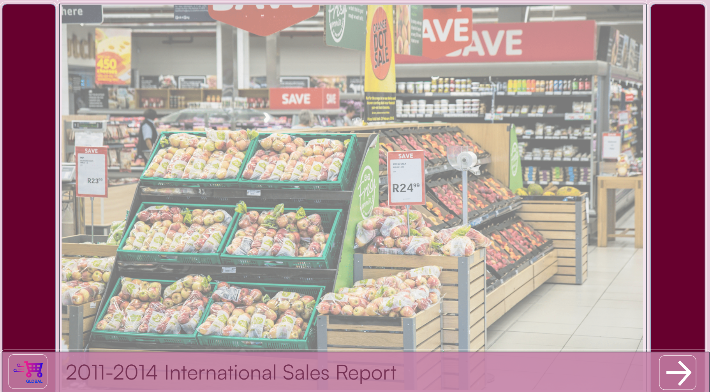
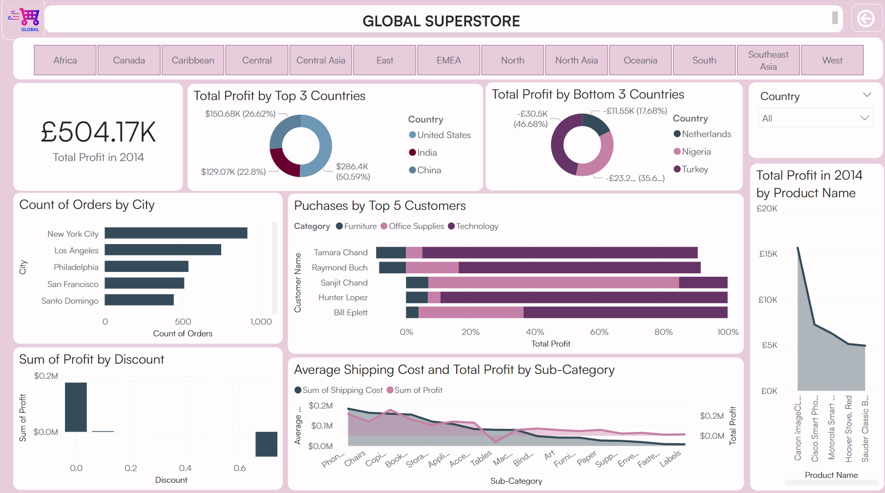
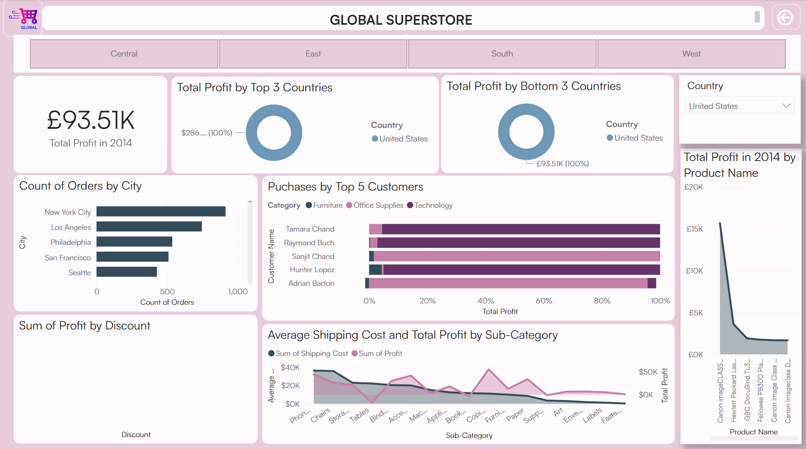
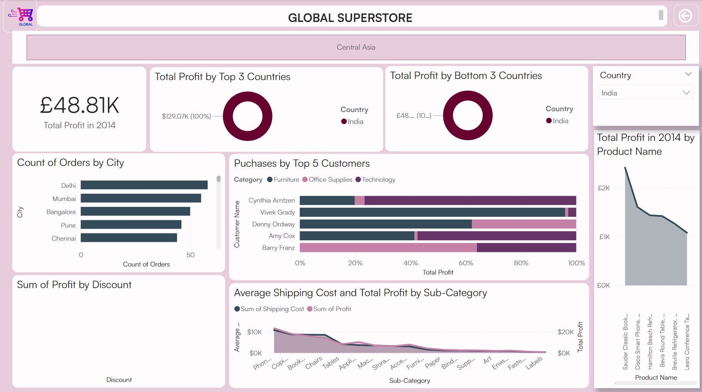
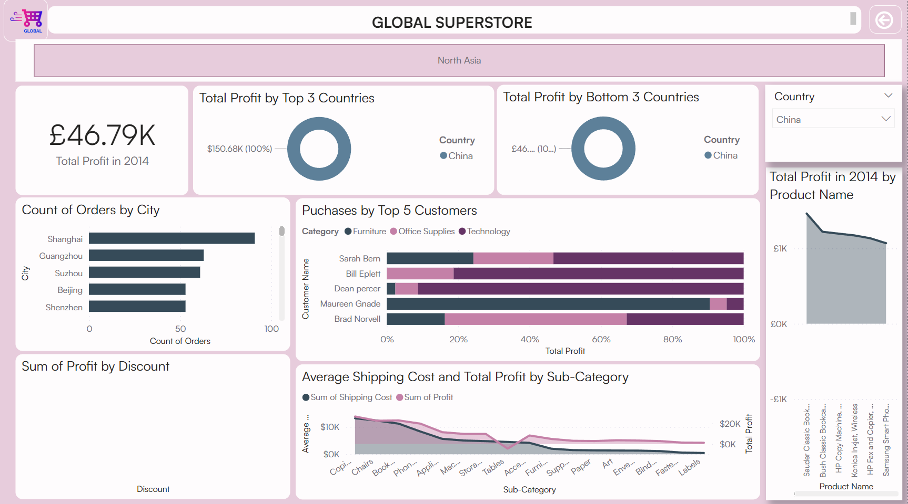
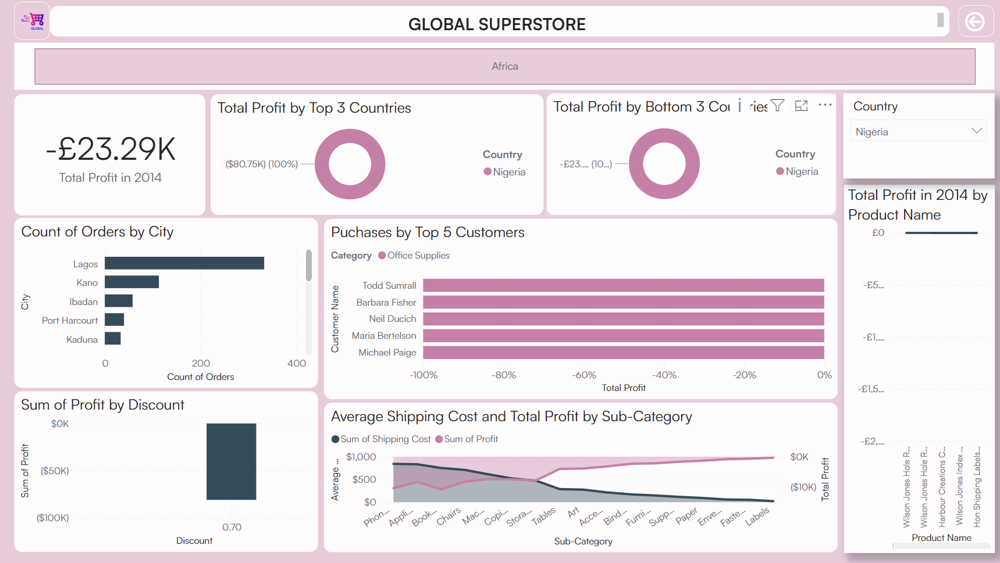
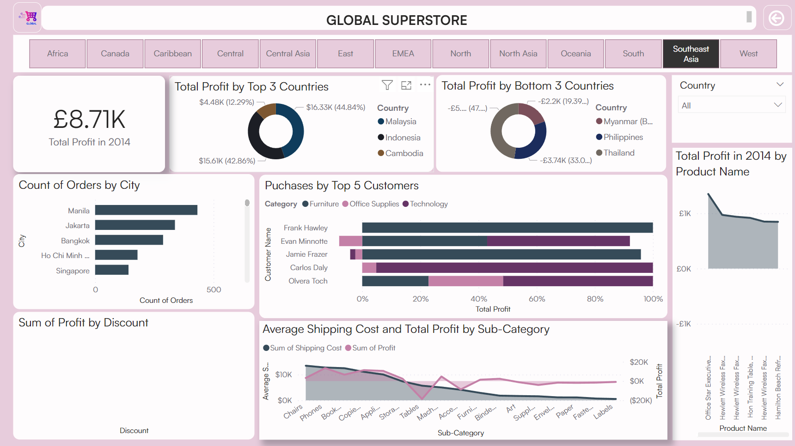
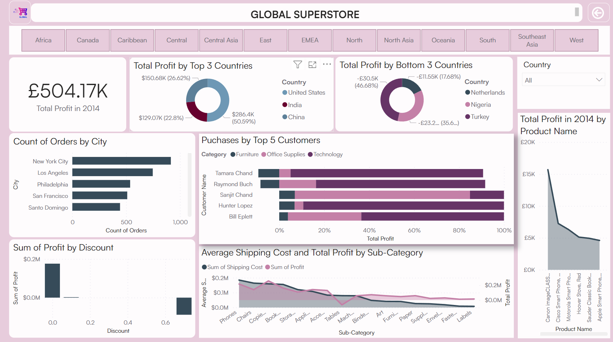

# Global Superstore Analysis

## A digitaley drive project
This data analysis project aims to exhibit my skills in analyzing and visualising sales data by providing insights into the sales performance pf Global Superstore, an international company over a period of 4 years (2011-2014).
By analysing various aspects of the sales data, I was able to identify trends,answer the business problems posed inn the question, and make data-driven recommendation.
8**_Disclaimer_** : _All datasets and reports do not represent any comapney, Institution or country, but is a dummy dataset to demonstrate capabilities on Power BI._

The Report consists of 2 pages
1. Home Page
2. Content Analysis

## Problem Statement
To help Global Superstore analyze and draw out meaningful insights from the Superstore dataset which would aid management in making informed decisions to improve performance and profitability by answering the following questions:

## Skills/Concepts demonstrated
The following Power BI features were incorporated-
- DAX
- Quick measures
- Page Navigation
- Filters
- Tooltips
- Button
- Slicers

## Data Sourcing
Data was provided by Faux Global Superstore Data Team as an excel workbook file, and then imported into Power BI for analysis.

## Data Transformation
Data cleaning and transformation was carried out using power query editor. After scrutinizing all the columns, they were found to be valid and free of error. However,some fixes were required for the data type on the columns. 

Therefore, I tranformed the following columns
The data type of the **Sales**, **Profit**, and **Shipping cost** columns were transformed into the fixed decimal number format appropriate for currency.
The Discount column consisted a wide range of 29 distinct values, so a new column named **"Discount Band"** was created to classify the Discount data into manageable and easily identifiable ranges, namely: Low, Medium, and High.

## Data Modelling
No modelling was required since we need just a table for the analysis

## Analysis and Visualisation

This is the homepage above.

This is the Content analysis page above. Here we could discover the following insights:

1.The top three countries that generated the highest total profit for Global Superstore in 2014 were The United States, India, and China. The bottom 3 countries are Netherlands, Nigeria and Turkey (as shown in homepage)

2.The top 3 products with the highest total profit for each of these countries are:               
               
 United States
- a. Canon Image Class 2200 Advanced Copier (£1,679.9552)
- b. Cisco Smart Phone, Full size (£7,262.348)
- c. Motorola Smart Phone Full Size(£6,307.557)

   
 India
- a. Sauder Classic Bookcase, Traditional (£2,149.65)
-  b. Cisco Smart Phone,With Caller ID (£1,609.38)
- c. Hamilton Beach Refrigirator, Red (£1,440.24)                

        
 China
- a. Sauder Classic Bookcase, Metal (£1,463.07)
- b. Bush Classic Bookcase, Mobile (£1,220.52)
- c. HP Copy Machione Color (£1,196.13)

  
3. The 3 subcategories with the highest average shipping cost in the United States are:
- a. Tables
- b. Copiers
- c. Bookcases

Profit in Nigeria               |        Profit in Rest Of Africa
:------------------------------:|:-----------------------------------:
   |   

4. Nigerias garnered a total loss of £23,290 in 2014. Nigeria did not contribute to the £39,330 made by all Arican countries in that year. Nigeria gave the highest average discounts of all the African countries. With an average discount of 0.7 (in a 0.0 - 0.85 range), Nigeria accounted for £80,750 of £88,610 in discounts.

5. The least profitable product category in Southeast Asia is 'Tables'. It is recommended that the Southeast Asia branch of Global Superstore should stop offering Tables subcategory in Indonesia. It has garnered a total loss of -£10680.28.

6.The product subcategory with the highest average profit in Australia is Copiers (£18,805.14)

7.  Here are the most valuable customers and the highest-purchased category of products from Golbal superstore.
            a. Tamara Chand (Technology- £9,125)
            b. Raymond Buch (Technology- £7,639)
            c. Sanjit Chand (Office Supplies- £6,394)
            d. Hunter Lopez (Technology- £6,980)
            e. Bill Eplett  (Technology- £4,702)
## Conclusions and Recommendations

